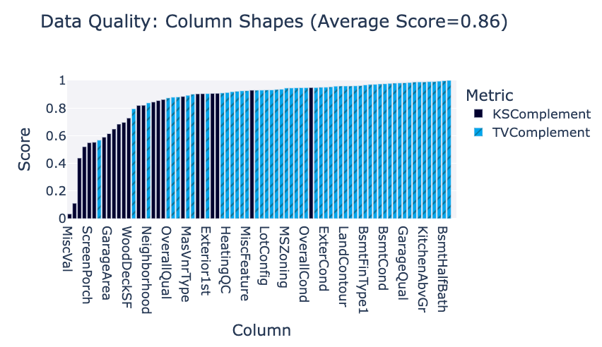
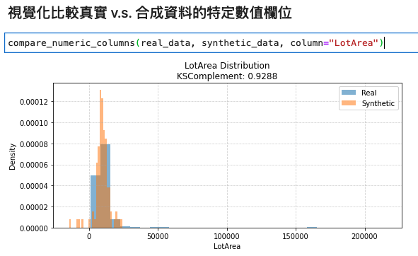
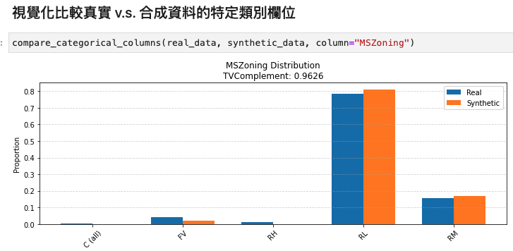

# Synthetic Data Module on Python 3.9
> Author: Tao Chen

## 環境安裝
python version 3.9.23

```
python -m venv venv
source venv/bin/activate
```

```
pip install --upgrade pip setuptools wheel

# 合成資料核心工具
pip install sdv==1.23.0
pip install sdmetrics==0.21.0
pip install pandas==2.3.0
pip install numpy==2.0.2
pip install scikit-learn==1.6.1
pip install scipy==1.13.1
pip install matplotlib==3.9.4
```

## 使用步驟

測試範例資料
form https://www.kaggle.com/c/boston-housing/overview

放在 input/data.csv

### 1. 訓練合成資料產生器
使用 `syndata_model_train_py36.ipynb`

修改前兩個參數，分別是真實資料的路徑，以及合成資料模型輸出的資料夾
```python
args = set_args([
    "--input_path", "input/data.csv", # input 真實資料 csv 格式的表單
    "--output_dir", "output/",   # 合成資料輸出路徑
    "--synth_model", "GaussianCopula",  # 合成資料模型演算法
    "--primary_key", "Id",  # key 欄位名稱
    "--num_rows", "100",  # 生成的資料筆數
    "--save_model",    # 設定模型
    "--save_output"    # 設定儲存
])

main(args)
```
這步驟需要一段時間，依 CPU 規格與輸入資料大小決定等待時間長短

步驟完成後可以在 output_dir 看到一個  `syn_model_GaussianCopula.pkl` 檔案，那個就是合成資料模型 (合成資料產生器)

除了模型外這個步驟也會產出 100(預設) row 的合成資料 csv 檔放在 output_dir 中

### 2. 使用合成資料產生器生成合成資料
使用 `syndata_generator_py36.ipynb`
載入上一步驟訓練好的合成資料模型 `syn_model_GaussianCopula.pkl` 檔，生成合成資料

參數說明:
- input_syn_model: `syn_model_GaussianCopula.pkl` 的檔案路徑
- output_fpath: 合成資料 csv 檔案輸出路徑
- num_rows: 欲生成的合成資料的資料筆數

修改以下設定
```python
args = set_args([
    "--input_syn_model", "output/syn_model_GaussianCopula.pkl", # 合成資料生成模型路徑 
    "--output_fpath", "output/syn_data.csv",   # 合成資料輸出路徑
    "--num_rows", "100",  # 生成的資料筆數
    "--save_output"
])

main(args)
```
這步驟需要一段時間，依 CPU 規格與輸入資料大小決定等待時間長短
步驟完成後可以在 output_dir 看到合成資料的 csv 檔案


### 3. 使用評估工具比較合成資料與真實資料的統計相似性
`syndata_quality_evaluate.ipynb`

修改真實資料與合成資料 csv 檔案路徑
```python
## inputs
real_data = pd.read_csv("input/data.csv")  ## 真實資料路徑
synthetic_data = pd.read_csv("output/data_GaussianCopula_output.csv") ## 合成資料路徑

syndata_eval_df = evaluate_al
l_columns(real_data, synthetic_data)  # 注意順序！ 真實資料放前面，合成資料放後面
```

SDV 套件提供的視覺化 Quality Report


可視覺化比較欄位





### 4. 使用合成資料產生器模組之 sample command

* 使用模組 [syndata_generator.py](syndata_generator.py)
* 參考指令 [cmd.sh](cmd.sh)

cmd.sh:

```shell
echo "without chunking"
python syndata_generator.py \
    --input_syn_model output/syn_model_GaussianCopula.pkl \
    --output_fpath output/syn_data_1K.csv \
    --num_rows 1000 \
    --save_output


echo "with chunking"
python syndata_generator.py \
    --input_syn_model output/syn_model_GaussianCopula.pkl \
    --output_fpath output/syn_data_10M.csv \
    --num_rows 10000000 \
    --save_output \
    --use_chunk \
    --chunk_size 1000000

```
注意： 
**--chunk_size 數字必須小於 --num_rows**

例: num_rows 1 千萬，chunk_size 可以設為 1 百萬

chunk_size 最大值取決於系統記憶體大小可負荷範圍
